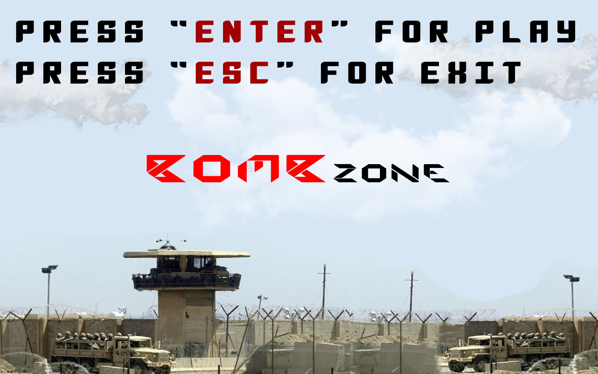
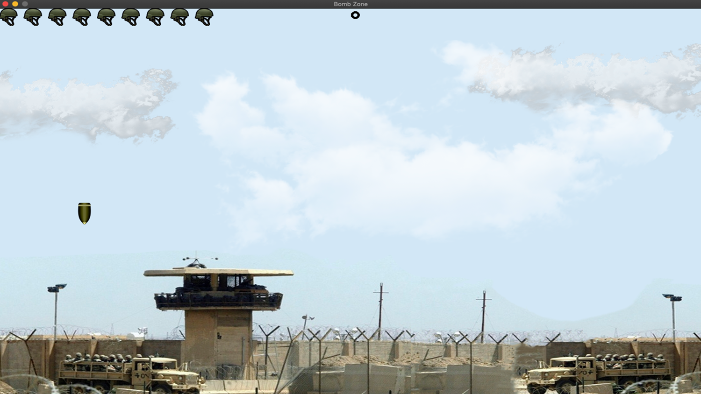

# Challenge task
**Create a 2d game with any graphics library.**

## Graphic library

_v2 (assembly for mac os)_

## Screenshots

## Supported platform
_Only for MAC OS_

# **Make games, not war!**
